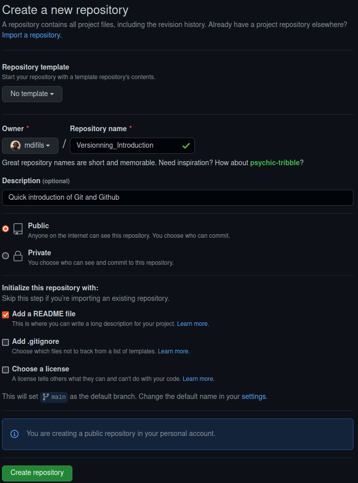
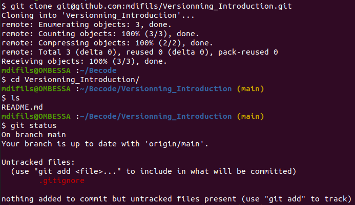
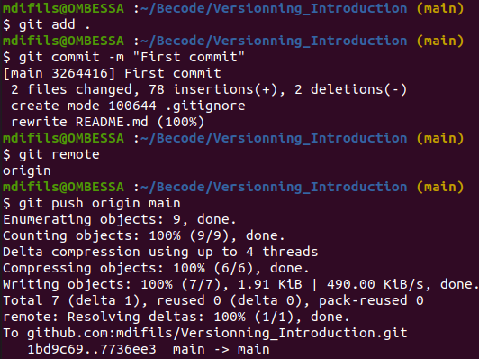

# Introduction

Git is the free and open source distributed version control system that's 
responsible for tracking every single modification that happens in your
local repository (folder that's being monitored).  
Github is a tool that leverages the power of Git. It allow you to host your
local repository in a remote server. This allow you to share your projects with
others and to collaborate on the same project.

# Installation

Go to [git official website](https://git-scm.com/) to download and install it.
Choose your operating system and follow the instructions.

There is no installation for github, just go to their 
[official website](https://github.com/) and create an account.

# Configuration

## Git settings

set a name that is identifiable for credit when review version history.  
`git config --global user.name "firstname lastname"`  
set an email address that will be associated with each history marker  
`git config --global user.email "youremail@example.com"`  
set a default editor (in my case I'm using vscode or code)   
`git config --global core.editor "code --wait"`  
set the default branch for all your repos  
`git config --global init.defaultbranch main`

## Github settings

To generate a new ssh key, I type the following command and complete:  
`ssh-keygen -t ed25519 -C "your-github-email@example"`  
output:  
```
Generating public/private ed25519 key pair.
Enter file in which to save the key (/home/mdifils/.ssh/id_ed25519): 
Enter passphrase (empty for no passphrase): 
Enter same passphrase again:
```

A private/public key pair is then generated. In order for your local machine to 
communicate with github you need to the public key into your github account. Also, 
if you don't want to reenter your passphrase every time you use your SSH key, 
you can add your private key to the SSH agent, which manages your SSH keys and 
remembers your passphrase.

```bash
# start the ssh-agent in the background
eval `ssh-agent -s`

# Add your SSH private key to the ssh-agent
ssh-add ~/.ssh/id_ed25519
```

After adding your private to the ssh-agent, you can now add your public key to 
github by first copying its content:

```bash
# for linux users
xclip -sel clip < ~/.ssh/id_ed25519.pub

# windows users
clip < ~/.ssh/id_ed25519.pub
```

Then you can paste it by following the steps describe in this
[tutorial](https://docs.github.com/en/authentication/connecting-to-github-with-ssh/adding-a-new-ssh-key-to-your-github-account)

# Creatind a new repository

There are two ways to create a new repository

## From Github



- Clone your repo: `git clone git@github.com:mdifils/Versionning_Introduction.git`
- Move into the repo: `cd Versionning_Introduction/`
- List repo content : `ls`
- Create a new file: `touch .gitignore`
- Add a line to that file: `echo .vscode > .gitignore`
- Check repo status: `git status`
- Stage new file: `git add .gitignore` or stage all file: `git add .`
- Commit changes: `git commit -m "First commit"`
- Check remote alias: `git remote`
- Push changes to github: `git push origin main`





## From my local machine

1. First create a directory for your project: `mkdir versionning_introduction`
2. Move into your newly created directory: `cd versioning_introduction`
3. Initialize your new directory as a repository: `git init`
4. Create a readme file: `touch README.md`
5. Write a quick a introduction: `echo # Git Tutorial > README.md`
6. Create a new repo with the same name on Github without README.
7. Finally, add changes to the stage area, commit and push them on github
